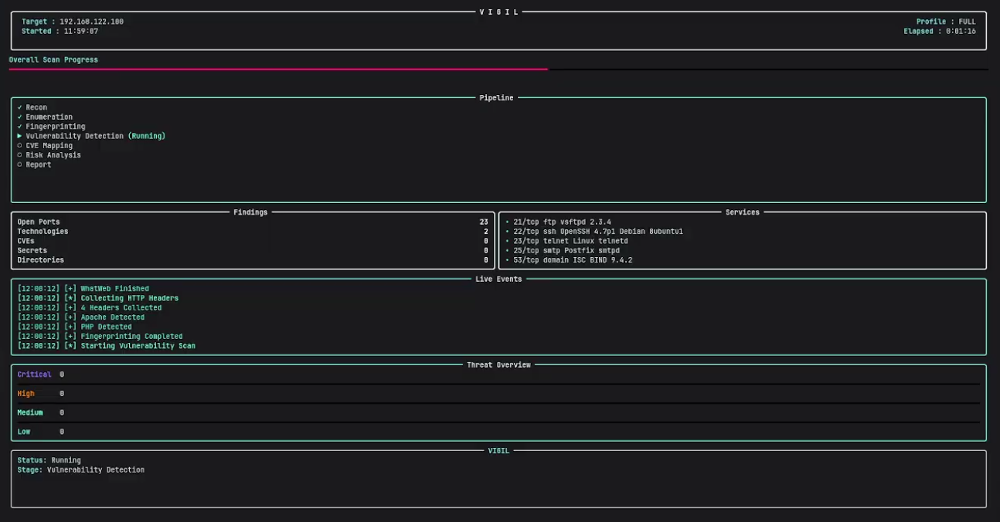
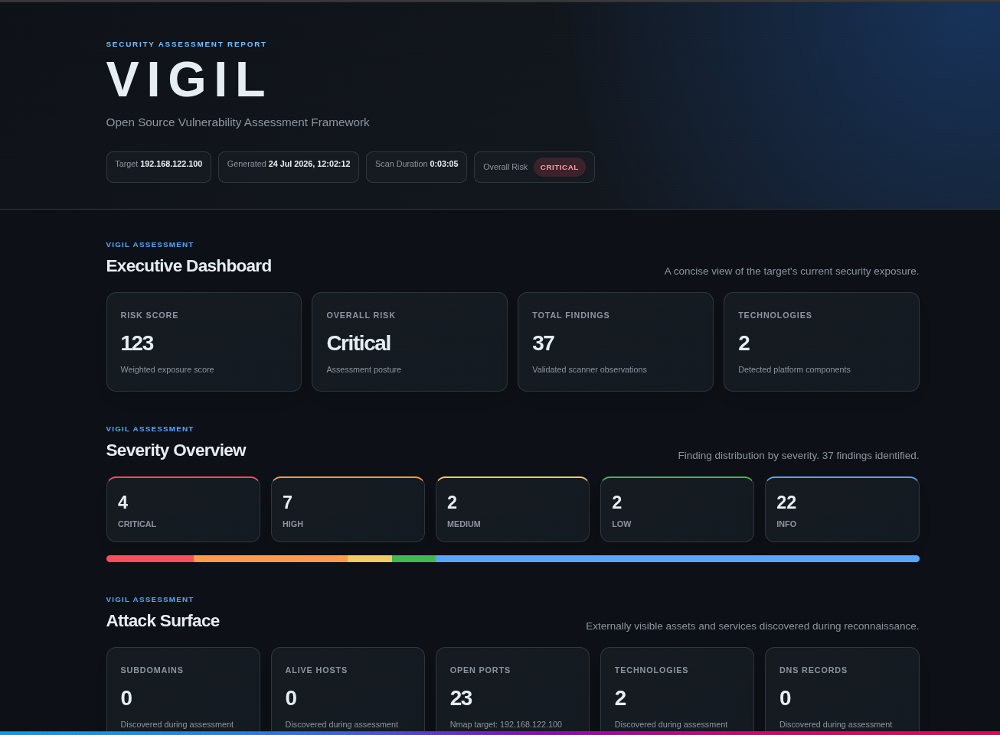
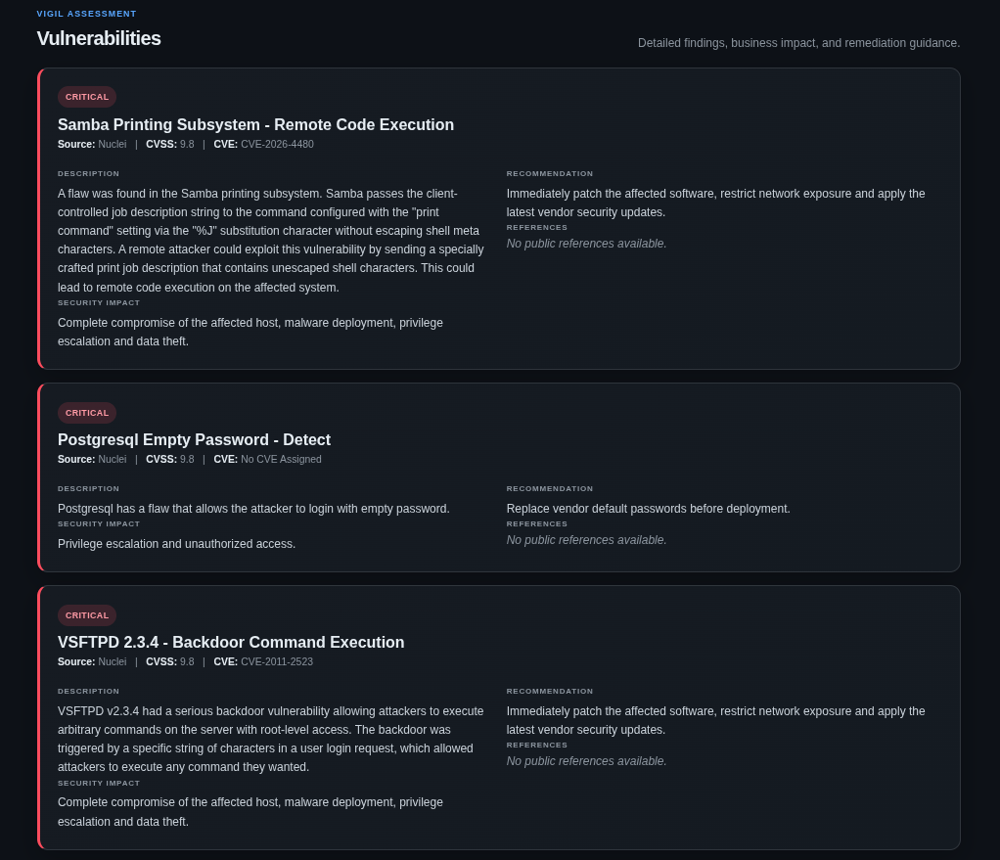
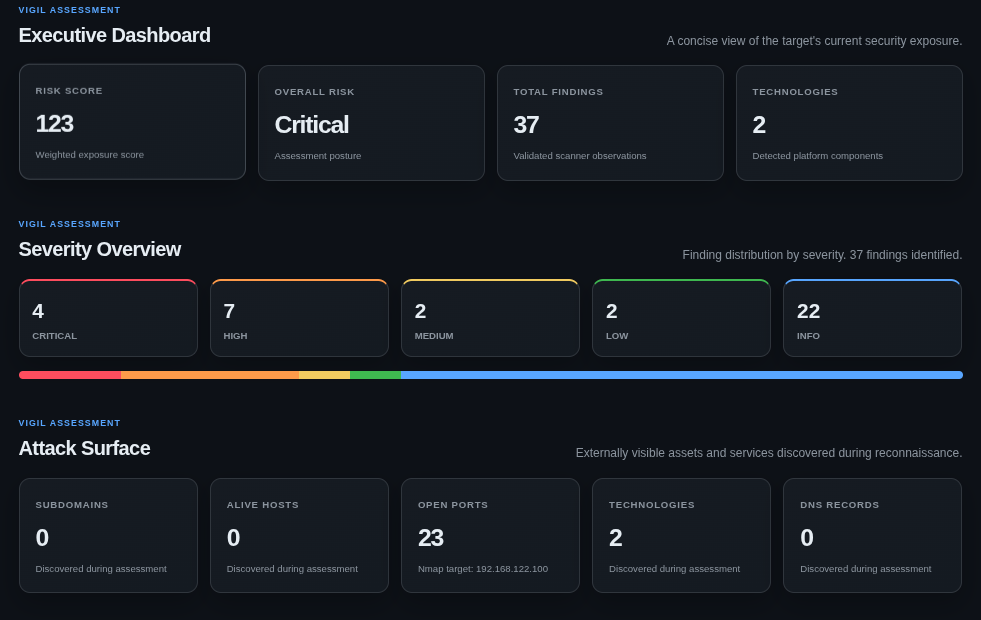

<div align="center">

# 🛡️ VIGIL

### Open Source Vulnerability Assessment Framework

An automated security assessment framework that performs **Reconnaissance, Enumeration, Fingerprinting, Vulnerability Detection, CVE Mapping, Risk Analysis, and Professional HTML Reporting** using industry-standard open-source security tools.


</div>

---

## 📖 Overview

VIGIL is an **Open Source Vulnerability Assessment Framework** designed to automate the early phases of security assessments. It combines multiple industry-standard open-source tools into a single workflow, enabling security professionals and students to efficiently identify exposed services, detect vulnerabilities, enrich findings with CVE information, calculate overall risk, and generate professional HTML reports.

The framework follows a structured assessment pipeline that reduces manual effort while producing organized, actionable results.

---

## ✨ Key Features

- 🔍 Automated Reconnaissance
- 🌐 Service Enumeration
- 🖥️ Technology Fingerprinting
- 🚨 Vulnerability Detection
- 🛡️ CVE Enrichment
- 📊 Risk Analysis
- 📄 Professional HTML Report Generation
- 📈 Interactive Terminal Dashboard
- ⚡ Modular Architecture
- 🔧 Easy Tool Integration

---

## 📑 Table of Contents

- [Overview](#-overview)
- [Key Features](#-key-features)
- [Architecture](#-architecture)
- [Screenshots](#-screenshots)
- [Installation](#-installation)
- [Usage](#-usage)
- [Project Structure](#-project-structure)
- [Tools Used](#-tools-used)
- [Roadmap](#-roadmap)
- [Disclaimer](#-disclaimer)
- [License](#-license)
---

# 🏗️ Architecture

VIGIL follows a modular vulnerability assessment pipeline, where each stage performs a specific task before passing the results to the next module.

```text
                 ┌─────────────┐
                 │   Target    │
                 └──────┬──────┘
                        │
                        ▼
             ┌────────────────────┐
             │ Reconnaissance     │
             └─────────┬──────────┘
                       │
                       ▼
             ┌────────────────────┐
             │ Enumeration        │
             └─────────┬──────────┘
                       │
                       ▼
             ┌────────────────────┐
             │ Fingerprinting     │
             └─────────┬──────────┘
                       │
                       ▼
             ┌────────────────────┐
             │ Vulnerability Scan │
             └─────────┬──────────┘
                       │
                       ▼
             ┌────────────────────┐
             │ CVE Enrichment     │
             └─────────┬──────────┘
                       │
                       ▼
             ┌────────────────────┐
             │ Risk Analysis      │
             └─────────┬──────────┘
                       │
                       ▼
             ┌────────────────────┐
             │ HTML Report        │
             └────────────────────┘
```

---

# ⚙️ Assessment Workflow

The framework executes each stage in sequence, ensuring that information collected in earlier phases is reused throughout the assessment.

| Stage | Description |
|--------|-------------|
| 🔍 Reconnaissance | Discovers the target and gathers publicly available information. |
| 🌐 Enumeration | Identifies live hosts, open ports, running services, and operating system details using Nmap. |
| 🖥️ Fingerprinting | Detects technologies, web servers, frameworks, and software versions. |
| 🚨 Vulnerability Detection | Performs automated vulnerability scanning using multiple security tools. |
| 🛡️ CVE Enrichment | Maps identified vulnerabilities to publicly known CVEs whenever possible. |
| 📊 Risk Analysis | Calculates the overall security posture based on detected findings and their severity. |
| 📄 HTML Report | Generates a professional report containing findings, impacts, recommendations, and executive summaries. |

---

# 🔄 Assessment Pipeline

VIGIL integrates multiple open-source security tools into a single automated workflow.

```text
Target
   │
   ├── Reconnaissance
   │      ├── Subfinder
   │      ├── HTTPX
   │      ├── DNSX
   │      └── Katana
   │
   ├── Enumeration
   │      └── Nmap
   │
   ├── Fingerprinting
   │      └── WhatWeb
   │
   ├── Vulnerability Detection
   │      ├── Nuclei
   │      ├── Nikto
   │      └── FFUF
   │
   ├── CVE Mapping
   │
   ├── Risk Analysis
   │
   └── HTML Report Generation
```

---

# 📊 Output

After the assessment completes, VIGIL generates:

- Professional HTML security report
- Executive summary
- Risk score and severity breakdown
- CVE-enriched vulnerability findings
- Remediation recommendations
- Enumeration summary
- Technology fingerprinting results
- Complete scan logs
---

# 📸 Screenshots

> **Note:** The screenshots below showcase VIGIL's interactive dashboard and the generated HTML vulnerability assessment report.

## 🖥️ Interactive Dashboard

The live dashboard provides real-time visibility into the assessment process.

It displays:

- Current assessment stage
- Overall progress
- Live event logs
- Running services
- Discovered vulnerabilities
- Risk summary
- Scan statistics

<p align="center">

</p>

---

## 📄 Professional HTML Report

After the assessment completes, VIGIL automatically generates a professional HTML report containing all discovered findings.

The report includes:

- Executive Summary
- Risk Overview
- Service Enumeration
- Technology Fingerprinting
- Vulnerability Details
- CVE Information
- Security Recommendations
- Scan Metadata

<p align="center">

</p>

---

## 🚨 Vulnerability Analysis

Each finding is enriched with detailed information to help security analysts quickly understand and remediate vulnerabilities.

Every vulnerability card contains:

- Severity
- CVSS Score
- Description
- Business Impact
- Recommendation
- References
- CVE Information (when available)

<p align="center">

</p>

---

## 📊 Executive Summary

VIGIL provides a high-level overview of the assessment, making it easy to understand the target's overall security posture.

The executive summary includes:

- Overall Risk Level
- Total Findings
- Severity Distribution
- Open Ports
- Services Identified
- Technologies Detected
- Scan Duration

<p align="center">

</p>

---

## 📈 Risk Distribution

The generated report categorizes findings based on severity to help prioritize remediation efforts.

Severity Levels:

- 🔴 Critical
- 🟠 High
- 🟡 Medium
- 🔵 Low
- ⚪ Informational

<p align="center">

</p>
---

# 🚀 Installation

## Prerequisites

Before using VIGIL, ensure the following requirements are installed on your system.

### Operating System

- Linux (Recommended)
- Python 3.14+
- Git
- Go

---

## Required Security Tools

| Tool | Purpose |
|------|---------|
| Nmap | Port scanning and service enumeration |
| Nuclei | Vulnerability detection |
| Subfinder | Subdomain discovery |
| HTTPX | HTTP probing |
| DNSX | DNS enumeration |
| Katana | Web crawling |
| WhatWeb | Technology fingerprinting |
| FFUF | Content discovery |
| Nikto | Web server vulnerability scanning |

---

## Clone the Repository

```bash
git clone https://github.com/Null-Trace0/VIGIL.git
cd VIGIL
```

---

## Install Python Dependencies

```bash
pip install -r requirements.txt
```

---

## Verify Installation

Ensure all required tools are available.

```bash
python main.py --help
```

If the help menu appears successfully, VIGIL is ready to use.

---

# 💻 Usage

Run a complete assessment against a target domain:

```bash
python main.py -d example.com
```

Skip Nuclei scanning:

```bash
python main.py -d example.com --skip-nuclei
```

Skip Nikto scanning:

```bash
python main.py -d example.com --skip-nikto
```

---

# 📂 Generated Output

After each assessment, VIGIL generates structured output inside the project directory.

```text
output/
├── recon/
├── enumeration/
├── fingerprint/
├── scanner/
├── vulnerability/
├── reports/
│   └── report.html
└── logs/
```

The generated HTML report can be opened in any modern web browser for detailed analysis.

---

# ⚡ Features at a Glance

✔ Automated Reconnaissance

✔ Service Enumeration

✔ Technology Fingerprinting

✔ Vulnerability Detection

✔ CVE Mapping

✔ Risk Analysis

✔ Professional HTML Report

✔ Interactive Terminal Dashboard

✔ Modular Architecture

---

# 📁 Project Structure

The project is organized into modular components, making it easy to maintain, extend, and integrate new features.

```text
VIGIL/
├── core/                  # Core assessment modules
│   ├── recon.py
│   ├── enumeration.py
│   ├── fingerprint.py
│   ├── scanner.py
│   ├── vulnerability.py
│   ├── cve.py
│   ├── risk.py
│   ├── report.py
│   └── knowledgebase.py
│
├── ui/                    # Interactive dashboard
│   ├── dashboard.py
│   └── state.py
│
├── output/                # Scan outputs
├── reports/               # Generated HTML reports
├── logs/                  # Scan logs
├── requirements.txt
├── config.py
├── main.py
├── LICENSE
└── README.md
```

---

# 🛠️ Tools Used

VIGIL integrates several industry-standard open-source security tools to automate different phases of a vulnerability assessment.

| Tool | Purpose |
|------|---------|
| Nmap | Port scanning and service enumeration |
| Nuclei | Template-based vulnerability scanning |
| Subfinder | Subdomain discovery |
| HTTPX | HTTP probing |
| DNSX | DNS enumeration |
| Katana | Web crawling |
| WhatWeb | Web technology fingerprinting |
| FFUF | Content and directory discovery |
| Nikto | Web server vulnerability scanning |

---

# 🗺️ Roadmap

### ✅ Current Features

- Automated Reconnaissance
- Service Enumeration
- Technology Fingerprinting
- Vulnerability Detection
- CVE Enrichment
- Risk Analysis
- Interactive Terminal Dashboard
- Professional HTML Report Generation
- Modular Framework Design

### 🚀 Planned Features

- PDF Report Export
- Multi-target Scanning
- Custom Scan Profiles
- API-Based Scanning
- Plugin Support
- Docker Deployment
- Configuration Wizard
- Authentication Testing Modules

---

# ⚠️ Disclaimer

VIGIL is intended **only for educational purposes, security research, and authorized penetration testing**.

Users are solely responsible for ensuring they have proper authorization before scanning or testing any system.

The developers of VIGIL are **not responsible for any misuse, unauthorized activities, or damages resulting from the use of this software.**

---

# 📄 License

This project is licensed under the **MIT License**.

See the **LICENSE** file for complete licensing information.

---

# 🙏 Acknowledgements

VIGIL would not be possible without the incredible open-source security community.

Special thanks to the developers and maintainers of:

- Nmap
- ProjectDiscovery (Nuclei, Subfinder, HTTPX, DNSX, Katana)
- WhatWeb
- FFUF
- Nikto
- Python
- Rich

Your contributions continue to advance the cybersecurity community.

---

<div align="center">

### ⭐ If you found VIGIL useful, consider giving the repository a star!

Built to simplify and automate vulnerability assessments using open-source security tools.

</div>
---

# 🤝 Contributing

Contributions are welcome!

If you would like to improve VIGIL, feel free to:

- Report bugs
- Suggest new features
- Improve documentation
- Optimize existing modules
- Submit pull requests

Please ensure that your changes follow the project's coding style and include appropriate documentation where necessary.

---

# 🐞 Reporting Issues

If you encounter a bug or have a feature request, please open an issue on GitHub with the following information:

- Operating System
- Python Version
- Steps to Reproduce
- Expected Behavior
- Actual Behavior
- Relevant Logs or Error Messages

---

# 📬 Contact

For questions, suggestions, or collaboration opportunities:

- GitHub: https://github.com/Null-Trace0

---

<div align="center">

## 🛡️ VIGIL

**Open Source Vulnerability Assessment Framework**

Automating reconnaissance, enumeration, fingerprinting, vulnerability detection, CVE enrichment, risk analysis, and professional reporting.

⭐ **If you found this project useful, consider giving it a star!**

</div>
